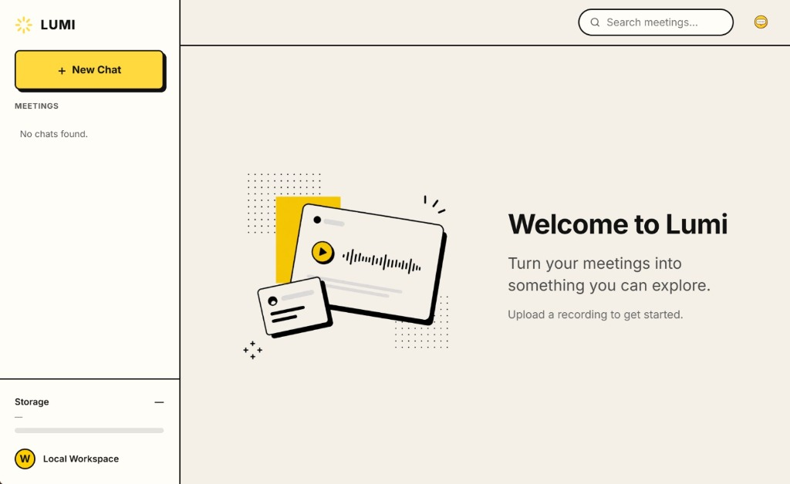

# Lumi

> Self-hosted meeting intelligence with transcription, speaker diarization, semantic search, and RAG-powered meeting chat.

Lumi is a self-hosted meeting intelligence application. It transcribes recorded meetings, identifies speakers, indexes the content for semantic search, and answers questions about meetings using retrieval-augmented generation over a local LLM.

<div align="center">
  <a href="https://github.com/YashBhardwaj21/Lumi/releases/download/Lumi-initial_release/lumi.mp4">
    
  </a>
</div>


## What it does

- Upload audio/video meeting recordings
- Process recordings asynchronously via a background job queue
- Transcribe speech with Faster-Whisper
- Identify speakers via an external diarization service (optional)
- Align speaker segments with transcript text
- Chunk and embed transcripts, store vectors in pgvector
- Answer questions per meeting using RAG with persistent chat history
- Store uploaded media in MinIO (S3-compatible)
- Manage meetings, jobs, and chats through a React interface

## Architecture

```text
                    ┌──────────────┐
                    │   React UI   │
                    └──────┬───────┘
                           │
                           ▼
                    ┌──────────────┐
                    │   FastAPI    │
                    └──────┬───────┘
                           │
              ┌────────────┼────────────┐
              ▼            ▼            ▼
         PostgreSQL      Redis         MinIO
         + pgvector     (queue)     Media Storage
                           │
                           ▼
                    ┌──────────────┐
                    │  ARQ Worker  │
                    └──────┬───────┘
                           │
                    ┌──────┴───────┐
                    ▼              ▼
              Speech-to-Text   Diarization
                    │              │
                    └──────┬───────┘
                           ▼
                  Speaker-aware
                    Transcript
                           │
                           ▼
                       Chunking
                           │
                           ▼
                      Embeddings
                           │
                           ▼
                     pgvector
                           │
                           ▼
                    Ollama / LLM
                           │
                           ▼
                       Answer
```

Diarization is not bundled in Docker Compose. It runs as a separate HTTP service and is called over an authenticated request. It is disabled by default.

## Tech Stack

| Layer | Technology |
|---|---|
| Frontend | React 18, TypeScript, Vite, React Router |
| Backend | FastAPI, Python, SQLAlchemy (async) |
| Background jobs | ARQ, Redis |
| Database | PostgreSQL 16 |
| Vector search | pgvector |
| Object storage | MinIO (S3-compatible) |
| Transcription | Faster-Whisper |
| Diarization | Pyannote via external remote service |
| Embeddings | Ollama (`nomic-embed-text`) |
| LLM | Ollama (Gemma) |
| Migrations | Alembic |
| Infrastructure | Docker Compose |

## Project Structure

```text
Lumi/
├── backend/
│   ├── app/
│   ├── alembic/
│   ├── tests/
│   ├── Dockerfile
│   └── requirements.txt
├── docs/
│   ├── architecture.md
│   ├── configuration.md
│   ├── development.md
│   └── diarization.md
├── frontend/
│   ├── src/
│   ├── Dockerfile
│   └── package.json
├── docker-compose.yml
├── .env.example
├── .gitignore
└── LICENSE
```

## Requirements

- Docker
- Docker Compose
- Ollama (running on the host, for LLM and embedding inference)
- Git

## Setup

### 1. Clone the repository

```bash
git clone https://github.com/YashBhardwaj21/Lumi.git
cd Lumi
```

### 2. Create the environment file

```bash
cp .env.example .env
```

Fill in the required values in `.env`. Never commit `.env`.

Diarization is optional. If enabling it, set the remote diarization URL and shared API key.

### 3. Pull the required Ollama models

```bash
ollama pull gemma3:4b
ollama pull nomic-embed-text
```

Ollama must be running and reachable at `OLLAMA_BASE_URL` before starting the stack.

### 4. Start the application

```bash
docker compose up --build
```

This starts:

- `frontend` — React app
- `backend` — FastAPI API
- `worker` — ARQ background worker
- `db` — PostgreSQL + pgvector
- `redis` — job queue and cache
- `minio` — object storage

### 5. Open the application

| Service        | URL                            |
| -------------- | ------------------------------- |
| Frontend       | http://localhost:3000           |
| Backend API    | http://localhost:8000           |
| MinIO console  | http://localhost:9001           |

## Usage

1. Open the frontend at `http://localhost:3000`.
2. Upload an audio or video meeting recording.
3. Wait for background processing to complete.
4. Open the processed meeting to view its transcript.
5. Start a chat for the meeting.
6. Ask questions about the meeting.
7. Rename and manage meetings from the interface.

## Processing Flow

```text
Upload → MinIO → Background Job (ARQ)
  → Media Processing
  → Speech-to-Text (Faster-Whisper)
  → Speaker Diarization (optional, remote)
  → Speaker / Transcript Alignment
  → Transcript Storage
  → Chunking
  → Embeddings (Ollama)
  → pgvector
```

Processing runs entirely in the `worker` process, not in the API request path.

## Question Answering

Lumi uses retrieval-augmented generation, scoped to a chat within a meeting.

```text
User Question
  → Question Embedding
  → pgvector Similarity Search
  → Relevant Transcript Chunks
  → Chunks + Chat History
  → Ollama LLM
  → Grounded Answer
```

## API

All endpoints are served under `/api/v1`:

| Resource      | Description                                  |
| -------------- | --------------------------------------------- |
| `/files`       | Presigned upload, upload completion, storage usage |
| `/meetings`    | Create and list meetings                     |
| `/jobs`        | Job status, retry, cancel                    |
| `/transcripts` | Fetch a meeting's transcript                 |
| `/chats`       | Create chats, ask questions, message history |

### Health

```text
GET /health
GET /ready
```

`/health` provides a basic liveness check. `/ready` verifies required dependencies such as PostgreSQL, Redis, MinIO, and the ARQ worker.

## Development

```bash
# Full stack
docker compose up --build

# All logs
docker compose logs -f

# Worker logs only
docker compose logs -f worker

# Stop
docker compose down
```

Backend tests:

```bash
cd backend
pytest
```

## Configuration

All configuration is provided through `.env`, loaded via `pydantic-settings`. Main areas:

- App (name, debug, CORS)
- Database (`DATABASE_URL`)
- Redis (`REDIS_URL`)
- Object storage (MinIO endpoint, credentials, bucket)
- File limits (max size, presign expiry)
- ASR (model, device, chunking, concurrency)
- Diarization (`DIARIZATION_ENABLED`, remote URL, API key, timeout)
- Embeddings (provider, model, dimensions, batch size)
- LLM (provider, Ollama URL, model, temperature, RAG top-k)
- Transcript chunking (max tokens, overlap, tokenizer)
- Worker (temp dir, max attempts, max media duration, temp storage cap)

The repository's `.env.example` covers all of these with working defaults.

## Notes

- Ollama runs on the host and is accessed by the Docker containers through `OLLAMA_BASE_URL`.
- Speaker diarization runs as a separate authenticated HTTP service and is disabled by default.
- The diarization service requires GPU-capable infrastructure for practical inference.

## Documentation

For more detailed information on specific components of Lumi, refer to the documentation:

- [Architecture & Data Flow](docs/architecture.md)
- [Configuration Guide](docs/configuration.md)
- [Local Development Setup](docs/development.md)
- [External Diarization Service](docs/diarization.md)

## License

MIT
